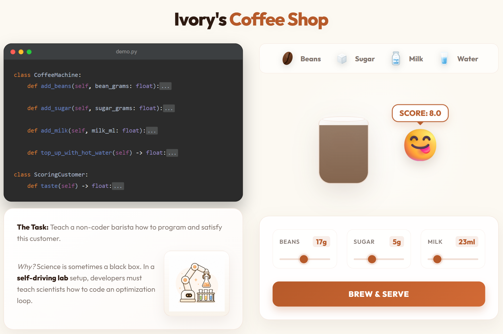
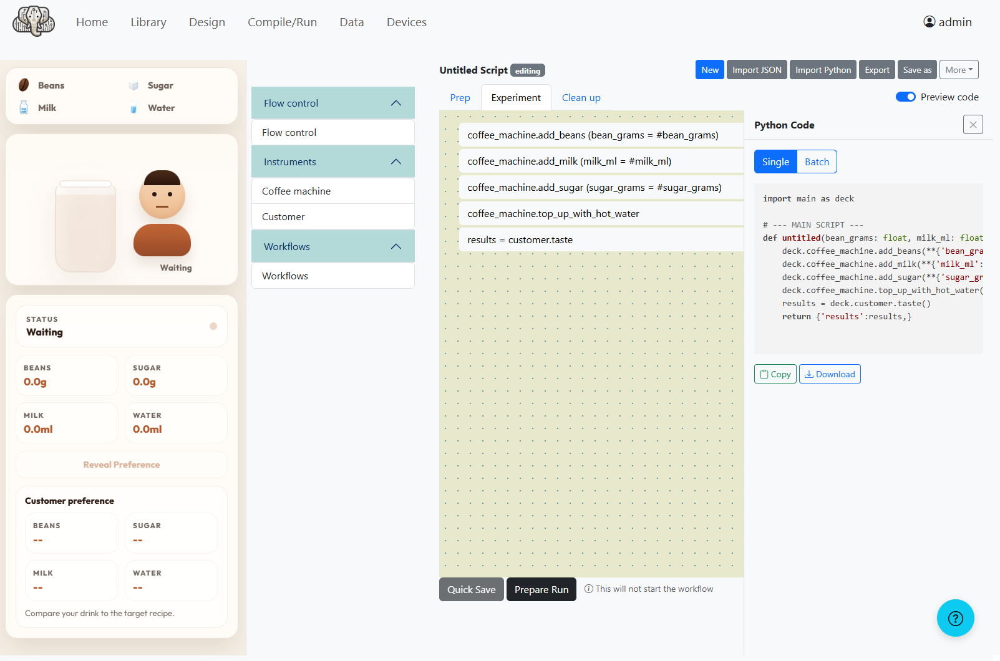
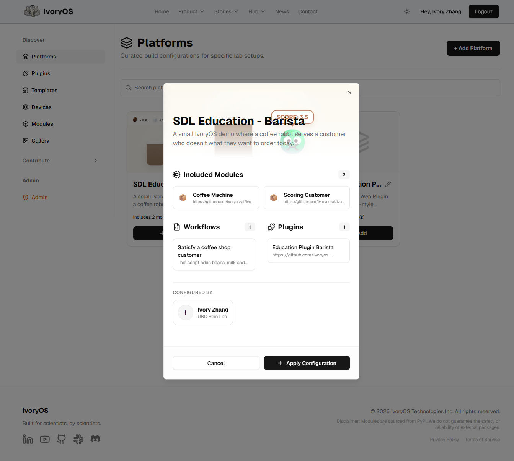

# Explain Self-Driving Labs and IvoryOS with a Barista

A public-facing IvoryOS demo that uses a coffee shop and an automated barista to explain IvoryOS.



## The Story

Making good coffee is a science.
You change inputs, observe the outcome, collect feedback, and try again until the result improves.

This demo starts with a coffee shop.
You have a customer who does not know exactly what they want, but they can still tell you whether they like the drink by giving it a score.

As the barista, you are given a Python-driven automated coffee machine.
You want to explore different recipes and satisfy the customer, but you do not want to lose your sanity repeating the same trials over and over again by hand.
You want to automate that process.

There is one problem: baristas do not code.
If the machine is only accessible through Python, the person who actually needs to run it is blocked by the interface.

## From Code To Interface
That is where IvoryOS comes in.
IvoryOS can take Python-defined systems and turn them into a drag-and-drop interface, so the barista can operate and automate the process without writing a single line of code.
It also opens the door to AI-assisted optimization, where optimizers can learn from previous trials and suggest better next experiments.



In other words, the barista is not limited to manually trying random recipes.
They can use a visual workflow builder, access the underlying generated Python when needed, and plug into optimizers that improve suggestions based on earlier results.

## Why This Matters

Showing how one code repository works is useful, but it is only the first step.
The bigger question is what happens when you want to expand one coffee shop into a whole coffee chain.

Now you do not just need one machine.
You need a way to distribute that machine configuration, share the recipes, and teach other baristas how to operate the same workflow without rebuilding everything from scratch.

## From Code To Platform

That is where IvoryOS Hub comes in.
You configure your coffee machine, create and share recipes, and publish the full setup for others to use.
Another shop can download the platform with the shared workflow already preloaded, instead of reconstructing the whole thing manually.

In that sense, IvoryOS Hub works like a **no-code GitHub for platforms and workflows**:

- You define the machine setup.
- You save the workflow.
- You publish the platform.
- Other people can reuse it with the logic already in place.

This barista platform is here too:
https://ivoryos.ai/hub/platforms



## In SDL Terms

This coffee-shop story maps directly onto a self-driving lab:

- The **automated coffee machine** stands in for an automated experimental system or instrument stack.
- The **recipe inputs** stand in for experimental workflows and parameters.
- The **customer score** stands in for the measurement or objective you want to optimize.
- The repeated coffee trials stand in for iterative experiment cycles.
- The **barista** stands in for the non-coder who still needs to run, adjust, and understand the workflow.
- **IvoryOS** is the layer that turns Python-defined systems into a usable interface for non-coders.
- The optimization tools available through IvoryOS stand in for methods that learn from prior runs and guide the next experiment, such as Bayesian Optimization.
- **IvoryOS Hub** is the distribution layer that lets teams package, share, replicate, and reuse complete platforms and workflows.

That is why this demo is more than a coffee example.
It is a simple way to explain how IvoryOS helps bridge the gap between programmable automation and the people who actually need to use it in a self-driving lab.

## Run Locally

Install the project from the repository root:

```powershell
pip install .
```

Start the demo with:

```powershell
python main.py
```

## What's In This Repo

- `barista_demo` contains the coffee machine and scoring customer logic.
- `barista_visual_plugin` contains the UI plugin, templates, CSS, JavaScript, and assets used to present the demo.
- `main.py` launches the demo with IvoryOS.
